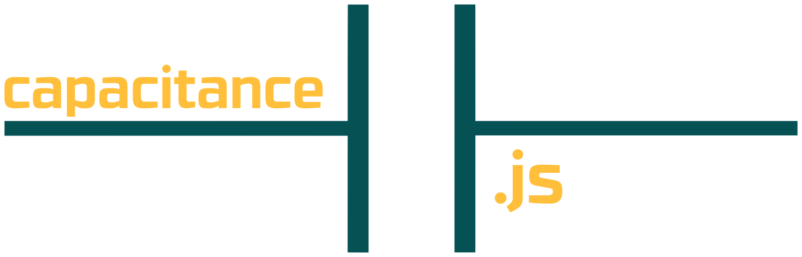

<p align="center">
  <a href="">
    
  </a>
</p>

<p align="center">
  Simple module to calculate electrical capacitance in series and parallel circuits.
</p>

<p align="center">

  <a href="https://codeship.com/projects/141662"></a>

  <a href="https://travis-ci.org/mabrasil/capacitance.js"></a>

  <a href="https://codeclimate.com/github/mabrasil/capacitance.js"></a>

  <a href="https://david-dm.org/mabrasil/capacitance.js" title="Dependency status"></a>

  <a href="https://david-dm.org/mabrasil/capacitance.js#info=devDependencies" title="devDependency status"></a>

</p>

## Table of Contents

- [Installation](#installation)
- [Usage](#usage)
- [API](#api)
- [Understand the Topic](#understand-the-topic)
- [Development](#development)
- [Contributing](#contributing)
- [Motivation](#motivation)
- [License](#license)

## Installation

```sh
$ npm install --save capacitance.js
```

## Usage

<p align="center">
  <a href="">
    
  </a>
</p>

```js
const capacitance = require('capacitance.js');

capacitance([1, 2, 3], 'series');
//=> 0.5454545454545455

capacitance([1, 2, 3], 'parallel');
//=> 6

console.log([1, 2, 3], 'parallel') + 'F')
// 6F
```

## API

### `capacitance(circuit, type)`

#### `circuit`

*Type*: `array`

*Description*: Values of capacitors associated in your circuit.

*Example*: `[1, 2, 3, 4]`

#### `type`

*Type*: `string`

*Description*: Type of capacitors association in your circuit.

*Options*:

  - `'series'` or `'s'`: Capacitors in series.
  - `'parallel'` or `'p'`: Capacitors in parallel.

## Understand the Topic

Combinating capacitors is very common in many circuits, when we want to reach a
capacitance level which only one capacitor is not enough.

### Capacitors in Series

In an association of series capacitors, the equivalent capacitor is equal to
the inverse of the sum of all the inverted capacitors which make up the
association:

```
1 / Ceq = (1 / C1) + (1 / C2) + (1 / C3) + ... + (1 / Cn)
```

### Capacitors in Parallel

In an association of parallel capacitors, the equivalent capacitor is equal to the
sum of all capacitors that make up the association:

```
Ceq = C1 + C2 + C3 + ... + Cn
```

## Development

All the tasks needed for development automation are defined in the
[`package.json`](package.json) *scripts* property and can be run via:

`npm run <command>`

Here is a summary of all the commands:

|  **Command**  |                                     **Description**                                      |
|---------------|------------------------------------------------------------------------------------------|
| `compile`     | Runs the Livescript compiler on the source.                                              |
| `test`        | Runs [Mocha](https://mochajs.org/) in BDD mode.                                          |
| `build`       | Runs both `compile` and `test` commands.                                                 |

## Contributing

Contributions are very welcome! If you'd like to contribute, these
[guidelines](CONTRIBUTING.md) may help you.

## Motivation

I was studying capacitors association because of my *Constant Current* discipline
and then decided to put the basics into practice.

## License

[capacitance.js](https://github.com/mabrasil/capacitance.js) is distributed under
the MIT License, available in this repository. All contributions are assumed to
be also licensed under the MIT License.
